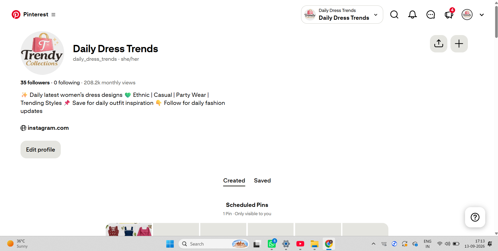
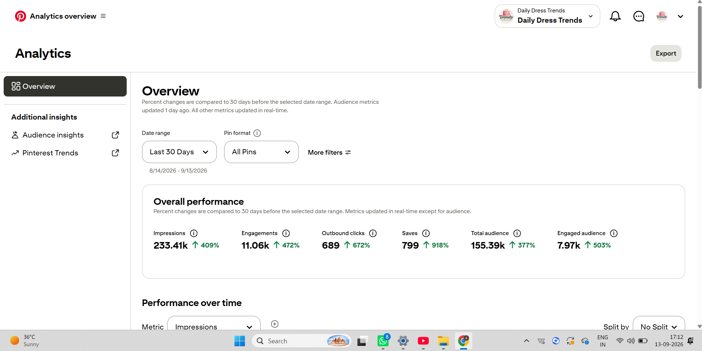

<!DOCTYPE html>
<html lang="en">
<head>
<meta charset="UTF-8">
<meta name="viewport" content="width=device-width, initial-scale=1.0">
<title>Teenu — Data Analytics × Marketing Growth</title>
<link rel="preconnect" href="https://fonts.googleapis.com">
<link href="https://fonts.googleapis.com/css2?family=Syne:wght@400;600;700;800&family=Inter:wght@300;400;500;600&display=swap" rel="stylesheet">

</head>
<body>

<!-- NAV -->
<nav>
  
Daily Dress Trends

  <ul class="nav-links">
    <li><a href="#home">Home</a></li>
    <li><a href="#growth">Growth Story</a></li>
    <li><a href="#case-study">Case Study</a></li>
    <li><a href="#projects">Projects</a></li>
    <li><a href="#analytics">Skills</a></li>
    <li><a href="#resume">Resume</a></li>
  </ul>
  <a href="#connect" class="nav-cta">Let's Connect</a>
  

</nav>

<!-- HERO -->
<section id="home">
  

  

  

    
Real-world Pinterest Growth Case Study

    <h1 class="hero-headline">I Turn Content Into Measurable Growth.</h1>
    

      Data Analytics
      Marketing Analytics
      Affiliate Marketing
      AI Content Creation
    

    
I combine creative content creation with data-driven decision making — building, analyzing and optimizing digital content using audience insights, performance metrics and marketing strategies that produce real, measurable outcomes.

    

      <a href="#growth" class="btn-primary">View My Growth Story</a>
      <a href="#projects" class="btn-outline">View Projects</a>
      <a href="#resume" class="btn-outline">Resume</a>
    

    

      <a href="https://in.pinterest.com/daily_dress_trends/" target="_blank" rel="noopener noreferrer" class="social-btn pinterest-btn">
        <svg class="social-icon" viewBox="0 0 24 24" fill="currentColor"><path d="M12 0C5.373 0 0 5.373 0 12c0 5.084 3.163 9.426 7.627 11.174-.105-.949-.2-2.405.042-3.441.218-.937 1.407-5.965 1.407-5.965s-.359-.719-.359-1.782c0-1.668.967-2.914 2.171-2.914 1.023 0 1.518.769 1.518 1.69 0 1.029-.655 2.568-.994 3.995-.283 1.194.599 2.169 1.777 2.169 2.133 0 3.772-2.249 3.772-5.495 0-2.873-2.064-4.882-5.012-4.882-3.414 0-5.418 2.561-5.418 5.207 0 1.031.397 2.138.893 2.738a.36.36 0 0 1 .083.345l-.333 1.36c-.053.22-.174.267-.402.161-1.499-.698-2.436-2.889-2.436-4.649 0-3.785 2.75-7.262 7.929-7.262 4.163 0 7.398 2.967 7.398 6.931 0 4.136-2.607 7.464-6.227 7.464-1.216 0-2.359-.632-2.75-1.378l-.748 2.853c-.271 1.043-1.002 2.35-1.492 3.146C9.57 23.812 10.763 24 12 24c6.627 0 12-5.373 12-12S18.627 0 12 0z"/></svg>
        
          Pinterest
          Growth Case Study ↗
        
      </a>
      <a href="https://www.instagram.com/style.withteenu?stkn=MWI1bWFwMjRtMmVoOQ==" target="_blank" rel="noopener noreferrer" class="social-btn instagram-btn">
        <svg class="social-icon" viewBox="0 0 24 24" fill="currentColor"><path d="M12 2.163c3.204 0 3.584.012 4.85.07 3.252.148 4.771 1.691 4.919 4.919.058 1.265.069 1.645.069 4.849 0 3.205-.012 3.584-.069 4.849-.149 3.225-1.664 4.771-4.919 4.919-1.266.058-1.644.07-4.85.07-3.204 0-3.584-.012-4.849-.07-3.26-.149-4.771-1.699-4.919-4.92-.058-1.265-.07-1.644-.07-4.849 0-3.204.013-3.583.07-4.849.149-3.227 1.664-4.771 4.919-4.919 1.266-.057 1.645-.069 4.849-.069zM12 0C8.741 0 8.333.014 7.053.072 2.695.272.273 2.69.073 7.052.014 8.333 0 8.741 0 12c0 3.259.014 3.668.072 4.948.2 4.358 2.618 6.78 6.98 6.98C8.333 23.986 8.741 24 12 24c3.259 0 3.668-.014 4.948-.072 4.354-.2 6.782-2.618 6.979-6.98.059-1.28.073-1.689.073-4.948 0-3.259-.014-3.667-.072-4.947-.196-4.354-2.617-6.78-6.979-6.98C15.668.014 15.259 0 12 0zm0 5.838a6.162 6.162 0 1 0 0 12.324 6.162 6.162 0 0 0 0-12.324zM12 16a4 4 0 1 1 0-8 4 4 0 0 1 0 8zm6.406-11.845a1.44 1.44 0 1 0 0 2.881 1.44 1.44 0 0 0 0-2.881z"/></svg>
        
          @style.withteenu
          AI Fashion Content ↗
        
      </a>
    

    

      

        
208K+

        
Monthly Pinterest Views

      

      

      

        
+918%

        
Saves Growth Last 30 Days

      

      

      

        
+672%

        
Outbound Clicks Last 30 Days

      

    

  

</section>

<!-- GROWTH / METRICS -->
<section id="growth">
  

    
Real Growth. Real Metrics.

    <h2 class="section-title reveal">Daily Dress Trends — Pinterest Performance</h2>
    
I built and manage <strong style="color:#fff">Daily Dress Trends</strong>, a fashion-focused Pinterest channel where I experiment with content strategy, creative formats, audience behaviour and performance optimization to drive measurable traffic and affiliate conversions.

    

      

35

Followers

      

208.2K

Monthly Views

    

    

      

        
0

        
+409%

        
Impressions — Last 30 Days

      

      

        
0

        
+472%

        
Engagements

      

      

        
0

        
+672%

        
Outbound Clicks ↗ Affiliate Traffic

      

      

        
0

        
+918%

        
Saves — Highest Intent Signal

      

      

        
0

        
+377%

        
Total Audience

      

      

        
0

        
+503%

        
Engaged Audience

      

    

    

      
GROWTH vs PREVIOUS 30-DAY PERIOD

      

Saves

+918%

      

Outbound Clicks

+672%

      

Engaged Audience

+503%

      

Engagements

+472%

      

Impressions

+409%

      

Total Audience

+377%

      
"Growth driven by consistent content, creative optimization, audience insights and data-driven decisions."

    

  

</section>

<!-- FUNNEL -->
<section id="funnel">
  

    
End-to-End Marketing

    <h2 class="section-title reveal">From Attention → Action → Revenue</h2>
    
My work goes beyond generating views. I track how content moves users from discovery and engagement toward outbound clicks, product traffic and affiliate outcomes — connecting content strategy with business results.

    

      

📌

Pinterest Content

Fashion creatives & pins

      
→

      

💬

Engagement

Reactions & interactions

      
→

      

🔖

Saves

High-intent signals

      
→

      

🔗

Outbound Clicks

Link-through traffic

      
→

      

🛍️

Meesho Traffic

Product page visits

      
→

      

📦

Orders

Conversions

      
→

      

💰

Affiliate Revenue

Commission earned

    

    
This end-to-end view demonstrates the connection between <strong>Content Strategy + Marketing Metrics + Data Analysis + Business Outcome</strong> — the kind of thinking MNCs and growth teams value.

  

</section>

<!-- CASE STUDY -->
<section id="case-study">
  

    
Pinterest Case Study

    <h2 class="section-title reveal">Daily Dress Trends</h2>
    
A real-world project at the intersection of content creation, affiliate marketing and performance analytics.

    

      

        

          Content Creator
          Affiliate Marketer
          Marketing Analytics
        

        <h3 style="font-family:'Syne',sans-serif;font-size:1.1rem;font-weight:700;margin-bottom:1.25rem;color:var(--violet);">What I Did</h3>
        

          

Created fashion-focused Pinterest content and product-focused creatives

          

Tested different content formats to identify what resonates

          

Used audience behaviour insights to improve content strategy

          

Monitored impressions, engagements and audience growth

          

Tracked outbound clicks as a proxy for affiliate intent

          

Analyzed saves and engaged audience to measure content quality

          

Used performance data to optimize future content decisions

          

Connected Pinterest traffic with Meesho affiliate marketing

        

      

      

        <h3 style="font-family:'Syne',sans-serif;font-size:1.1rem;font-weight:700;margin-bottom:1.25rem;color:var(--violet);">Skills Demonstrated</h3>
        

          Content StrategyAffiliate MarketingAudience AnalysisMarketing AnalyticsData-Driven DecisionsCreative OptimizationPerformance Tracking
        

        

          
KEY OUTCOME (Last 30 Days)

          

            

233K+

Impressions

            

689+

Outbound Clicks

            

799+

Saves

            

11K+

Engagements

          

        

      

    

    <h3 style="font-family:'Syne',sans-serif;font-weight:700;font-size:1rem;margin-bottom:1.25rem;color:var(--ink3);" class="reveal">VERIFIED ANALYTICS — ACTUAL SCREENSHOTS</h3>
    

      

        
        
Pinterest Profile — Daily Dress Trends · 208.2K monthly views

      

      

        
        
Pinterest Analytics Overview — Last 30 Days (8/14/2026 – 9/13/2026)

      

    

  

</section>

<!-- WORKFLOW -->
<section id="workflow">
  

    
My Approach

    <h2 class="section-title reveal">The Analytics Workflow</h2>
    
Every content decision is grounded in data. Here's the cycle I follow to drive consistent improvement.

    

      

1

Create

Develop fashion content and product creatives optimized for Pinterest formats

      

2

Measure

Track impressions, engagements, saves, outbound clicks and audience metrics

      

3

Analyze

Identify which content formats, topics and styles drive the most intent

      

4

Optimize

Improve titles, descriptions, creative direction and content strategy

      

5

Repeat

Use performance insights to guide the next content cycle

    

  

</section>

<!-- SKILLS -->
<section id="analytics">
  

    
Capabilities

    <h2 class="section-title reveal">Skills & Tools</h2>
    
I am building practical analytics skills alongside real marketing experience. The combination of data tools and live marketing execution sets my profile apart.

    

      

        
📊 Analytics

        

          PythonExcelData AnalysisData CleaningData VisualizationMarketing AnalyticsAudience Analysis
        

      

      

        
📣 Marketing

        

          Affiliate MarketingContent StrategyDigital MarketingPerformance TrackingData-Driven DecisionsAudience Analysis
        

      

      

        
🎨 Creative & AI

        

          AI Content CreationVisual ContentCreative OptimizationSocial Media Content
        

      

      

        
🛠️ Tools

        

          PinterestPower BIExcelPython
        

      

    

  

</section>

<!-- PROJECTS -->
<section id="projects">
  

    
Portfolio

    <h2 class="section-title reveal">Projects</h2>
    
Work that spans data, marketing and creative content — built to solve real problems.

    

      

        
📌

        
Pinterest Growth & Affiliate Marketing

        
Built and managed a fashion-focused Pinterest channel. Used content performance metrics to improve audience engagement, outbound traffic and affiliate marketing outcomes across a full content-to-conversion funnel.

        
233K+ Impressions689+ Clicks799+ Saves

        
Content StrategyAffiliate MarketingMarketing Analytics

      

      

        
🐍

        
Student Marks Management System

        
A Python-based academic management project for storing, processing and retrieving student marks data — demonstrating data handling, logic building and basic data processing skills.

        
PythonData ManagementData Processing

      

      

        
📊

        
Power BI Sales Dashboard

        
Interactive dashboard project focused on transforming sales data into clear visual business insights — covering KPI tracking, trend analysis and dashboard design for business decision support.

        
Power BIData VisualizationKPI TrackingBusiness Insights

      

      

        
✨

        
AI Outfit Content Creation

        
Experimented with AI-assisted fashion and outfit visuals to create social-media-ready content — exploring creative content production workflows and digital marketing applications of generative AI tools.

        
AI Content CreationFashion ContentSocial MediaCreative Strategy

      

    

  

</section>

<!-- WHY DIFFERENT -->
<section id="why">
  

    
What Sets This Apart

    <h2 class="section-title reveal">Why This Portfolio Is Different</h2>
    
Most student portfolios show coursework. This one shows a live audience, real platform analytics and a working affiliate funnel.

    

      

        
01

        
A Real Audience

        
Daily Dress Trends has an actual audience on Pinterest — not a classroom exercise. The metrics shown here come from a live platform with real users discovering, saving and clicking through to products.

      

      

        
02

        
Data Meets Marketing

        
I don't just create content — I measure it, analyze it and use the findings to make better decisions. This loop of creative execution and analytical thinking is what growth teams actually need.

      

      

        
03

        
Business-Aware Thinking

        
I track the journey from content discovery to saves to outbound clicks to affiliate traffic — understanding that business value comes from conversions, not just views.

      

    

  

</section>

<!-- RESUME -->
<section id="resume">
  

    
Open to Opportunities

    <h2 class="section-title reveal">What I'm Looking For</h2>
    
"Open to learning, experimenting and solving real business problems with data."

    
I'm interested in internship opportunities in:

    

      Marketing Analytics
      Growth Analytics
      Data Analytics
      Digital Marketing
      Business Analytics
      Data-Driven Marketing
    

    

      <a href="mailto:your@email.com" class="btn-primary">Get in Touch</a>
      Resume — Available on Request
    

    
B.Tech Computer Science & Business Systems · Data Analytics × Marketing Growth

  

</section>

<!-- CONNECT / SOCIAL -->
<section id="connect">
  

    
Find Me Online

    <h2 class="section-title reveal">Connect & Follow</h2>
    
See the real work in action — live content, real analytics and ongoing experiments across Pinterest and Instagram.

    

      <a href="https://in.pinterest.com/daily_dress_trends/" target="_blank" rel="noopener noreferrer" class="connect-card pinterest reveal">
        

          <svg viewBox="0 0 24 24"><path d="M12 0C5.373 0 0 5.373 0 12c0 5.084 3.163 9.426 7.627 11.174-.105-.949-.2-2.405.042-3.441.218-.937 1.407-5.965 1.407-5.965s-.359-.719-.359-1.782c0-1.668.967-2.914 2.171-2.914 1.023 0 1.518.769 1.518 1.69 0 1.029-.655 2.568-.994 3.995-.283 1.194.599 2.169 1.777 2.169 2.133 0 3.772-2.249 3.772-5.495 0-2.873-2.064-4.882-5.012-4.882-3.414 0-5.418 2.561-5.418 5.207 0 1.031.397 2.138.893 2.738a.36.36 0 0 1 .083.345l-.333 1.36c-.053.22-.174.267-.402.161-1.499-.698-2.436-2.889-2.436-4.649 0-3.785 2.75-7.262 7.929-7.262 4.163 0 7.398 2.967 7.398 6.931 0 4.136-2.607 7.464-6.227 7.464-1.216 0-2.359-.632-2.75-1.378l-.748 2.853c-.271 1.043-1.002 2.35-1.492 3.146C9.57 23.812 10.763 24 12 24c6.627 0 12-5.373 12-12S18.627 0 12 0z"/></svg>
        

        
Daily Dress Trends

        
pinterest.com/daily_dress_trends

        
My primary growth case study — fashion content, affiliate marketing and live Pinterest analytics. 208K+ monthly views, +918% saves, +672% outbound clicks in the last 30 days.

        
View Pinterest Profile <svg width="14" height="14" viewBox="0 0 16 16" fill="none" stroke="currentColor" stroke-width="2.5"><path d="M3 8h10M9 4l4 4-4 4"/></svg>

      </a>
      <a href="https://www.instagram.com/style.withteenu?stkn=MWI1bWFwMjRtMmVoOQ==" target="_blank" rel="noopener noreferrer" class="connect-card instagram reveal">
        

          <svg viewBox="0 0 24 24"><path d="M12 2.163c3.204 0 3.584.012 4.85.07 3.252.148 4.771 1.691 4.919 4.919.058 1.265.069 1.645.069 4.849 0 3.205-.012 3.584-.069 4.849-.149 3.225-1.664 4.771-4.919 4.919-1.266.058-1.644.07-4.85.07-3.204 0-3.584-.012-4.849-.07-3.26-.149-4.771-1.699-4.919-4.92-.058-1.265-.07-1.644-.07-4.849 0-3.204.013-3.583.07-4.849.149-3.227 1.664-4.771 4.919-4.919 1.266-.057 1.645-.069 4.849-.069zM12 0C8.741 0 8.333.014 7.053.072 2.695.272.273 2.69.073 7.052.014 8.333 0 8.741 0 12c0 3.259.014 3.668.072 4.948.2 4.358 2.618 6.78 6.98 6.98C8.333 23.986 8.741 24 12 24c3.259 0 3.668-.014 4.948-.072 4.354-.2 6.782-2.618 6.979-6.98.059-1.28.073-1.689.073-4.948 0-3.259-.014-3.667-.072-4.947-.196-4.354-2.617-6.78-6.979-6.98C15.668.014 15.259 0 12 0zm0 5.838a6.162 6.162 0 1 0 0 12.324 6.162 6.162 0 0 0 0-12.324zM12 16a4 4 0 1 1 0-8 4 4 0 0 1 0 8zm6.406-11.845a1.44 1.44 0 1 0 0 2.881 1.44 1.44 0 0 0 0-2.881z"/></svg>
        

        
style.withteenu

        
@style.withteenu

        
My AI-assisted fashion and outfit content profile — experimenting with generative AI for creative content production, social media strategy and digital fashion storytelling.

        
View Instagram Profile <svg width="14" height="14" viewBox="0 0 16 16" fill="none" stroke="currentColor" stroke-width="2.5"><path d="M3 8h10M9 4l4 4-4 4"/></svg>

      </a>
    

  

</section>

<!-- FOOTER -->
<footer>
  
Daily Dress Trends

  
Data Analytics × Marketing Growth × Affiliate Marketing

  

    <a href="https://in.pinterest.com/daily_dress_trends/" target="_blank" rel="noopener noreferrer" style="display:inline-flex;align-items:center;gap:0.5rem;color:#fff;text-decoration:none;font-size:0.82rem;font-weight:600;background:rgba(230,0,35,0.2);border:1px solid rgba(230,0,35,0.35);border-radius:100px;padding:0.4rem 1rem;transition:background 0.2s;" onmouseover="this.style.background='rgba(230,0,35,0.35)'" onmouseout="this.style.background='rgba(230,0,35,0.2)'">
      <svg width="14" height="14" viewBox="0 0 24 24" fill="#e60023"><path d="M12 0C5.373 0 0 5.373 0 12c0 5.084 3.163 9.426 7.627 11.174-.105-.949-.2-2.405.042-3.441.218-.937 1.407-5.965 1.407-5.965s-.359-.719-.359-1.782c0-1.668.967-2.914 2.171-2.914 1.023 0 1.518.769 1.518 1.69 0 1.029-.655 2.568-.994 3.995-.283 1.194.599 2.169 1.777 2.169 2.133 0 3.772-2.249 3.772-5.495 0-2.873-2.064-4.882-5.012-4.882-3.414 0-5.418 2.561-5.418 5.207 0 1.031.397 2.138.893 2.738a.36.36 0 0 1 .083.345l-.333 1.36c-.053.22-.174.267-.402.161-1.499-.698-2.436-2.889-2.436-4.649 0-3.785 2.75-7.262 7.929-7.262 4.163 0 7.398 2.967 7.398 6.931 0 4.136-2.607 7.464-6.227 7.464-1.216 0-2.359-.632-2.75-1.378l-.748 2.853c-.271 1.043-1.002 2.35-1.492 3.146C9.57 23.812 10.763 24 12 24c6.627 0 12-5.373 12-12S18.627 0 12 0z"/></svg>
      Pinterest
    </a>
    <a href="https://www.instagram.com/style.withteenu?stkn=MWI1bWFwMjRtMmVoOQ==" target="_blank" rel="noopener noreferrer" style="display:inline-flex;align-items:center;gap:0.5rem;color:#fff;text-decoration:none;font-size:0.82rem;font-weight:600;background:rgba(193,53,132,0.2);border:1px solid rgba(193,53,132,0.35);border-radius:100px;padding:0.4rem 1rem;transition:background 0.2s;" onmouseover="this.style.background='rgba(193,53,132,0.35)'" onmouseout="this.style.background='rgba(193,53,132,0.2)'">
      <svg width="14" height="14" viewBox="0 0 24 24" fill="#c13584"><path d="M12 2.163c3.204 0 3.584.012 4.85.07 3.252.148 4.771 1.691 4.919 4.919.058 1.265.069 1.645.069 4.849 0 3.205-.012 3.584-.069 4.849-.149 3.225-1.664 4.771-4.919 4.919-1.266.058-1.644.07-4.85.07-3.204 0-3.584-.012-4.849-.07-3.26-.149-4.771-1.699-4.919-4.92-.058-1.265-.07-1.644-.07-4.849 0-3.204.013-3.583.07-4.849.149-3.227 1.664-4.771 4.919-4.919 1.266-.057 1.645-.069 4.849-.069zM12 0C8.741 0 8.333.014 7.053.072 2.695.272.273 2.69.073 7.052.014 8.333 0 8.741 0 12c0 3.259.014 3.668.072 4.948.2 4.358 2.618 6.78 6.98 6.98C8.333 23.986 8.741 24 12 24c3.259 0 3.668-.014 4.948-.072 4.354-.2 6.782-2.618 6.979-6.98.059-1.28.073-1.689.073-4.948 0-3.259-.014-3.667-.072-4.947-.196-4.354-2.617-6.78-6.979-6.98C15.668.014 15.259 0 12 0zm0 5.838a6.162 6.162 0 1 0 0 12.324 6.162 6.162 0 0 0 0-12.324zM12 16a4 4 0 1 1 0-8 4 4 0 0 1 0 8zm6.406-11.845a1.44 1.44 0 1 0 0 2.881 1.44 1.44 0 0 0 0-2.881z"/></svg>
      @style.withteenu
    </a>
  

  
Built with real metrics from Daily Dress Trends on Pinterest. No exaggerated claims.

</footer>

</body>
</html>
